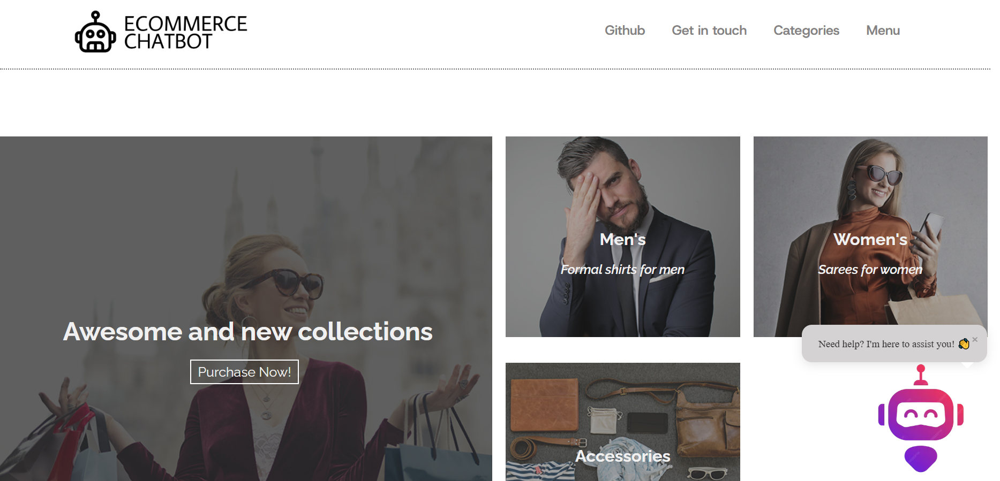
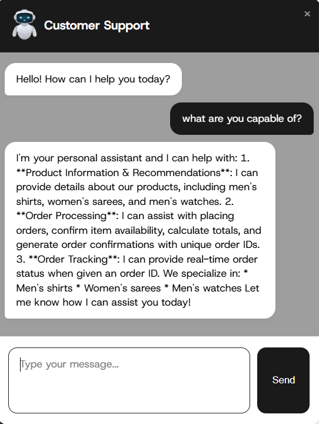

<h1 align="center">🤖 Ecommerce Chatbot</h1>
<h3 align="center"> End to End Data Sciene Project: "Customer Service Chatbot for an Ecommerce Clothing Company"</h3>
<p align="center">
  
  
  
  
  
  
  
  
  
</p>

<br>

# 📌 Ecommerce Chatbot
An GenAI-powered customer service chatbot for e-commerce, built using **LangChain, Pinecone, Groq, llama3.3 70b model**. The chatbot provides product recommendations, processes orders, tracks shipments, and remembers past conversations for a seamless user experience.

<br>

## 🎯 Project Overview
### 1. Data Collection
- Implemented automated web scraping using Selenium to extract product information from Amazon.
- Targeted different product categories including:
    - Formal Shirts for men
    - Sarees for women
    - Watches for men
- For each category the below details has been collected:
    - Brand name
    - Product name
    - Rating
    - Rating counts
    - Selling Price
    - MRP (original price)
    - Offer percentage


### 2. Data Cleaning and Preprocessing
- Performed thorough data cleaning and preprocessing on the collected dataset
- Handled missing values in ratings, rating counts, and other relevant columns
- Applied mode imputation to replace missing values as most of the columns are categorical

### 3. Vector Embedding
- Leveraged NVIDIA's embedding model "nv-embedqa-mistral-7b-v2" for vector embeddings
- Selected this model based on its top performance on the MTEB leaderboard
- Implemented embedding generation through the LangChain framework

### 4. Loading the Embeddings to Pinecone Vector Store
- Transferred generated embeddings to Pinecone, Pinecone is a purpose-built vector database for AI applications
- First created a Pinecone index using Python and 
- Uploaded the embeddings to the index to enable semantic search capabilities

### 5. LLM Model and Prompt Engineering
- Integrated "llama-3.3-70b-versatile" model via Groq through the LangChain framework
- Selected Groq for its significant enhancements in computational efficiency and response speed
- Developed optimized prompts with specific instructions and guidelines to maximize model performance and response

### 6. Setting up RAG (Retrieval Augmented Generation)
- Setup the Pinecone vector store as an retriever
- Created document chain after LLM and prompt configuration
- Created retrieval chain utilizing both the retriever and document chain
- Finally our fully functional RAG-based chatbot system is to be used

### 7. Flask Web Application
- Developed a web interface using Flask framework
- Created an e-commerce website with integrated chatbot functionality using HTML and CSS
- The final result delivers a user experience that is similar in a interaction with a customer service representative of a clothing company

<br>

# 🚀 Features
- **Product Recommendations**: Suggests products based on user queries and budget.
- **Order Processing**: Handles multiple items, calculates totals, and generates order confirmations.
- **Order Tracking**: Provides real-time order status updates.
- **Conversational Memory**: Retains chat history using **LangGraph** for better interactions.
- **Efficient Retrieval**: Uses **Pinecone** for fast, relevant document retrieval.

<br>

# 🏗️ Tech Stack
- **Python** (Flask for Web Interface)
- **Selenium** (For Webscraping amazon website)
- **LangChain** (LLM integration & retrieval-augmented generation)
- **Pinecone** (Vector database for retrieval)
- **HTML & CSS** (Frontend for chatbot UI)
- **GROQ API** (GROQ for accessing Llama 3.3 70b model) 

<br>

# :triangular_flag_on_post: Working with the chatbot  
- Chat in natural language.  
- Ask any kind of questions related to any products to the chatbot. Some products are listed in the website mention the product name or other details and ask further questions about the product.  
- Make orders.  
- Ask for invoice of your order.  
- Ask for recommendation for example: Recommend me a shirt under the budget of rupees 1000 but above rupees 500.   

<br>
  
# :bricks: Project Overview:    
## 1. Data Collection: 
    
- The first step in our project was collecting product data from Amazon. This data includes product details, pricing, and other metadata.       
- I used selenium to automate the webscraping process.    
- collected real-world product data from Amazon using Selenium for web scraping. The dataset includes details for:    
    - Men's Formal Shirts    
    - Women's Sarees    
    - Men's Watches    
- For each product, the following attributes were extracted:  
    - Brand Name  
    - Product Name  
    - Rating  
    - Rating Count  
    - Selling Price  
    - MRP (Maximum Retail Price)  
    - Offer/Discount  
  
## 2. Data Cleaning:
    
- The collected data has to been cleaned.    
- I have to handle the missing values as we will use the data to create a vector store and missing values negatively impact the reponse of our chatbot.  
- Used mode (most occured value) to fill in the missing values.  
- Majority of missing values were in the Rating column and Rating count.  
- Some missing values were found in the Price column and MRP.  
    
## 3. Pinecone Vector Store:
    
- I used the nvidia embedding model "nvidia/nv-embedqa-mistral-7b-v2", accessed the model directly through nvidia website.    
- Once embeddings has been setup, I create the pinecone vector index.     
- Upload documents to the vector store.        
  
## 4. Initiate LLM:
  
- Used the **Groq** to access the "llama3.3 70b" model.    
- Used groq because it enhances the speed of the response of an llm which is suitable for our chatbot.     
         
## 5. Build Retriever:
  
- Load the pinecone vector store and initiate it as a retriever.    
-  Our chatbot has to remember of the conversation, therefore we have to memory / history for the chatbot. Used the inbuild "chat_history" and "session_id" to build memory for the chatbot.  
        
## 6. Deployment:
  
- Developed a Flask application to deploy the chatbot for real time access.      
- Build an ecommerce website through html, css and integrated the chatbot in it.     
- Handled the chatbot receive and response part through javascript.      

<br>
  
# 📸 Screenshots  
### Screenshot of the website:  *(Click the icon on the right bottom of the screen to open the chatbot)*  
  
     
<br>  
  
### Screenshot of the chatbot:      
    

<br>

# 📂 Project Structure
```
/📂Ecommerce-Chatbot-Project
│── /📂Data                             # Data collected from amazon
│   ├── data_cleaned.csv                      
|   ├── data_shirts.csv                  
│   ├── data_sarees.csv                      
│   ├── data_watches.csv
│── /📂rough                          # Research and rough work                
│── /📂readme_images                  # Screenshots of the webapp
│   │── screenshot_1.png
│   │── screenshot_2.png
│── /📂src                            # Source files (core files of the project)
|   ├── main.py                       # Running the chabot locally
|   │── /📂components                 # Main components files
|   |  ├── scraper.py                
|   |  ├── data_colletion.py          
|   |  ├── data_cleaning.py          
|   |  ├── vectorstore_builder.py     
|   |  ├── chatbot_builder.py         
|   │── /📂utils                      # Utilities files 
|   |  ├── exception.py                
|   |  ├── logger.py                  
|   |  ├── chatbot_utils.py            
│── /📂static                         # Static folder
|   │── /📂css                        # Css files 
|   |   │── hp_style.css              # Home page styles
|   │── /📂images                     # Website Images
|   │── /📂js                         # javascripts  
│── /📂templates                      # Templates (html files)
|   │── /home_page.html
│── /📂notebook                       # Research ipynb notebook 
│── .gitignore
│── LICENCE
│── README.md
│── app.py                            # Flask backend
│── chromedriver.exe                  # Chrome driver application 
│── requirements.txt                  # Python dependencies
│── setup.py                          # Setup
```

<br>

# 🚀 Installation & Setup

### 1️⃣ Clone the Repository
```sh
git clone https://github.com/Dhanush-Raj1/Ecommerce-Chatbot-Project.git
cd Ecommerce-Chatbot-Project
```

### 2️⃣ Create a Virtual Environment
```sh
conda create -p envi python==3.9 -y
source venv/bin/activate   # On macOS/Linux
conda activate envi     # On Windows
```

### 3️⃣ Install Dependencies
```sh
pip install -r requirements.txt
```

### 4️⃣ Set Up Environment Variables
Create a `.env` file in the root directory and add:
```sh
NVIDIA_API_KEY=your_nvidia_api_key
PINECONE_API_KEY=your_pinecone_api_key
GROQ_API_KEY=your_groq_api_key
```

### 5️⃣ Run the Flask App
```sh
python app.py
```

The app will be available at: **http://127.0.0.1:5000/**

<br>


# 🎯 Future Enhancements
- Support for more product categories
- Integration with payment gateways
- Connectivity between customers and customer service employees
- Advanced memory support with backend database connection
- Improved accuracy on product recommendations
- Multi-language support

<br>

# 🤝 Contributing  
💡 Have an idea? Feel free to contribute or open an issue and pull requests!  

# 📄 License
This project is licensed under the **MIT License** – see the [LICENSE](LICENSE) file for details. 
